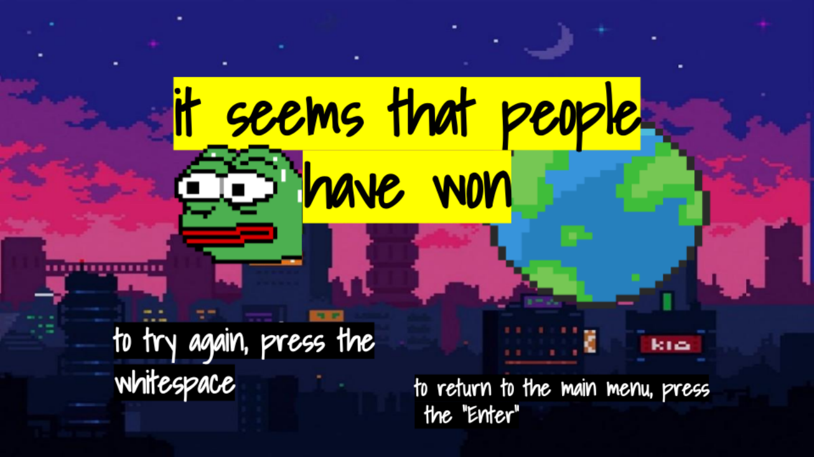

# Wave of zombies ("Волна зомби")
# Краткая характеристика
* Наименование программы: **Wave of zombies** - 2D-аркада.
* Назначение программы: игровая программа для **развлечения**.
* Конечные пользователи: любители **аркад** на платформе PC.

# Техническое задание
Разработать игровое приложение на языке Python с использованием возможностей библиотеки [**PyGame**](https://www.pygame.org/news). 


# Сборка и запуск
Разработка и тестирование программы осуществлено в операционной системе **Manjaro Linux 20.2.1 Nibia**.

## Файловая структура проекта
```text
[Wave_of Zombies]       # Директория приложения
├── data                # Папка со спрайтами, звуками и картинками
├── README.md           # Документация к игре
├── requirements.txt    # Список внешних зависимостей
└── main.py             # main-файл
```

Для успешного запуска и нормальной работы в операционной системе должны быть установлены следующее **компоненты**:

+ язык **Python 3.9.2**
+ библиотека **python-pygame 2.0.1**
+ библиотека **numpy 1.19.2**
 

# Функциональные возможности
Игрок управляет зомби. Его задача — **перепрыгивать препятсвия**, которые представлены в виде лавы и камня. Чтобы перепрыгнуть препятствие - нужно нажать на кнопку **пробел**(Space) .Цель игрока - **пройти уровень**.

## Игрок


# Уровень
Уровень - это карта в формате .txt, состоящая из определённых символов. На карте обозначены открытое пространство - **"."**, закрытое пространство - **"#"**(булыжник) и **"/"**(то, что под ним), **"l"** - лава, **"f"** - магма, **"c"** - зомбикоин, **"m"** - человек, **"p"** - портал.

# Объекты
# Человек

При соприкосновении с человеком игрок получает **+ 1 зомби** к общему числу зомби.

# Зомбикоин

При соприкосновении с зомбикоином игрок получает **+ 1 монетку** к общему числу монет.

# Бомба

При соприкосновении с бомбой игрок теряет **1 зомби** от общего количества зомби.

# Игровой интерфейс
# Заставка игры

После нажатие на **пробел**, открывается мини-история

# Мини-история

После нажатия на **пробел**, затем на **ЛКМ** начинается игра

# Смерть


# Победа
